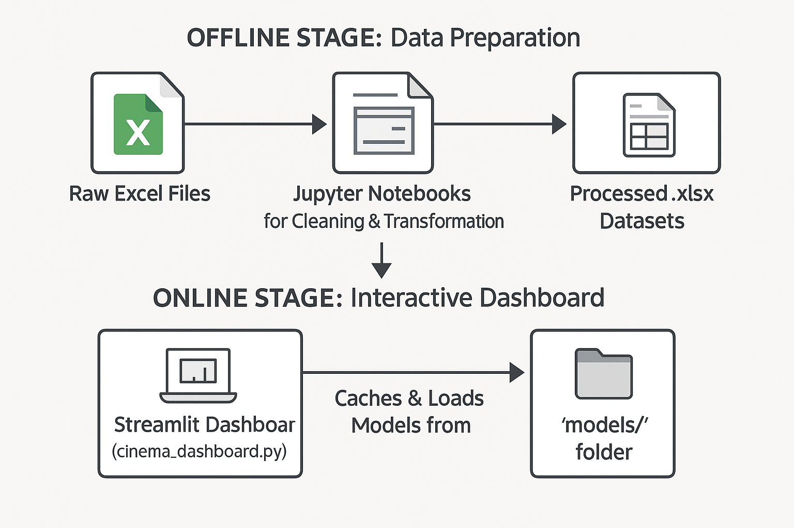

# Village Cinemas: F&B Analytics & Recommendation Dashboard


This project delivers an interactive dashboard for Village Cinemas, designed to perform in-depth Market Basket Analysis (MBA) on food and beverage sales. The application leverages a hybrid recommendation engine to uncover product affinities, identify promotional opportunities, and provide data-driven insights to enhance the customer experience.

### Key Features
- **Hybrid Recommendation Engine:** Combines Association Rule Mining (FP-Growth) and Collaborative Filtering (ALS) to generate robust product pairing suggestions.
- **Dynamic Contextual Filtering:** Allows users to generate highly specific recommendations by filtering the dataset on customer segments like movie genre, time of day, language, and more.
- **Performance Evaluation:** Measures the effectiveness of generated recommendations against a holdout test dataset using industry-standard metrics (Hit Rate, Precision@k, NDCG@k).
- **Scenario Explorer:** A "What If" tool to compare recommendation outcomes for two different customer segments side-by-side.

---

## ✅ 1. Project Deliverables

This section confirms the completion and status of all agreed-upon project deliverables.

- **Status:** All deliverables are **complete** and have been submitted. There are no pending or partially completed tasks.

The final deliverables are organized within this repository and include:
1.  **Data Processing Pipeline:** A set of two Jupyter Notebooks (`train_dataset_cleanup.ipynb` and `test_dataset_cleanup.ipynb`) designed to clean, transform, and feature-engineer raw transaction and session data.
2.  **Interactive Recommendation Dashboard:** The primary application (`cinema_dashboard.py`) built with Streamlit for all analysis and recommendations.
3.  **Comprehensive Documentation:** This `README.md` file, which serves as the central hub for technical specifications, user guides, and setup instructions.
4.  **Exploratory Analysis Notebook:** The `market_basket_analysis.ipynb` file contains the initial exploratory work and market basket analysis that informed the dashboard's design.
5.  **Final Project Presentation:** A PowerPoint file (`MBA Presentation.pptx`) detailing the project's methodology, key findings, and final outcomes.

---

## 📄 2. Documentation & Knowledge Transfer

This section provides the technical documentation, architectural overview, and key design decisions made during the project's development.

### 2.1. System Architecture

The system is designed with a two-part architecture: an **offline data preparation stage** and an **online interactive application stage**. The flow is as follows:

```
[ OFFLINE STAGE: Data Preparation ]
    Raw Excel Files --> [ Jupyter Notebooks for Cleaning & Transformation ] --> Processed .xlsx Datasets
    (Local Machine)                 (Located in cleanup folders)                   (Saved to input_datasets/)

                                                    |
                                                    V

[ ONLINE STAGE: Interactive Dashboard ]
  Processed Datasets --> [ Streamlit Dashboard (cinema_dashboard.py) ] --> Live Analysis & Recommendations
   (input_datasets/)                  |                                           (Displayed to User)
                                      |
                                      +-----> Caches & Loads Models from ------> [ 'models/' folder ]
```


<p align="center">
  
</p>


1.  **Data Preparation Pipeline (Offline):**
    -   **Purpose:** To ingest raw, multi-format Excel files and produce clean, standardized, and feature-rich datasets suitable for machine learning.
    -   **Process:** The Jupyter Notebooks perform header normalization, data type coercion, hierarchical price imputation for missing values, and one-hot encoding of categorical features (e.g., movie genres, time slots). The final output is a set of wide-format `.xlsx` files.

2.  **Dashboard & Recommendation Engine (Online):**
    -   **Purpose:** To provide a user-friendly interface for exploring data and generating recommendations without needing to run code.
    -   **Process:** The `cinema_dashboard.py` script loads the prepared datasets. When a user applies filters, it trains or loads cached models to generate recommendations in real-time.

### 2.2. Recommendation Engine Deep Dive

The dashboard uses a **hybrid model** to capitalize on the strengths of two distinct recommendation algorithms.

-   **Association Rule Mining (FP-Growth):**
    -   **What it does:** This algorithm analyzes "baskets" of items purchased together in a single transaction to find direct, frequent co-occurrence patterns.
    -   **Metrics Produced:** It generates rules with metrics like **Lift**, **Confidence**, and **Support**.
    -   **Use Case:** Excellent for identifying obvious, high-frequency pairings (e.g., "Customers who buy Popcorn also buy Coke"). It forms the basis of the "Combo Examples" tab.

-   **Collaborative Filtering (ALS - Alternating Least Squares):**
    -   **What it does:** This is a matrix factorization technique. It models the entire purchase history to create a low-dimensional "embedding" (a vector of numbers) for each item. Items with similar vectors are considered similar in terms of customer taste, even if they were never purchased together.
    -   **Metrics Produced:** **ALS Similarity**, which is the cosine similarity between item vectors.
    -   **Use Case:** Powerful for uncovering non-obvious, "hidden" relationships. For example, it might find that customers who enjoy arthouse films and buy coffee also have a higher affinity for premium chocolate, even if those purchases happen on different days. This drives the primary "Item Pairings" recommendations.

-   **The Hybrid Logic:** The system first uses Association Rules to identify candidate partner categories with strong co-purchase signals. It then uses the more nuanced ALS Similarity to rank these categories and recommend specific products within them, providing a balanced and powerful recommendation.

### 2.3. Understanding the Scores & Metrics

The dashboard presents several metrics. Here is what they mean and how to interpret them:

| Metric               | What It Measures                                                                  | How to Use It                                                                                              |
| -------------------- | --------------------------------------------------------------------------------- | ---------------------------------------------------------------------------------------------------------- |
| **Lift**             | How much more likely two items are purchased together than by random chance.      | A Lift > 1.0 indicates a positive association. A Lift of 3.0 means the pair is 3x more likely to be bought together. Excellent for finding strong, non-obvious combo deals. |
| **Confidence**       | The probability of buying Item B, given that Item A was purchased.                | Useful for one-way promotions. `Confidence(Popcorn -> Coke) = 80%` means 80% of popcorn buyers also bought Coke. A great prompt for upselling at the point of sale. |
| **Support**            | The overall frequency of an item or item-pair in all transactions.              | A measure of popularity. It's used to filter out rules based on rare, possibly coincidental purchases, ensuring our recommendations are statistically significant. |
| **ALS Similarity**     | A score (0 to 1) indicating how similar two items are based on user taste profiles. | The core metric for the primary recommendation engine. Higher scores suggest items appeal to the same type of customer, making them strong candidates for cross-promotion. |
| **Hit Rate@k**       | The percentage of test cases where at least one of our top `k` recommendations was correct. | A high-level measure of the system's usefulness. A high Hit Rate means the system is frequently suggesting relevant items to customers. |
| **Precision@k**      | Of the top `k` items we recommended, what percentage were actually purchased?       | Measures the quality of the recommendation list. High precision means fewer irrelevant suggestions and a better customer experience. |
| **NDCG@k**           | A score (0 to 1) that measures ranking quality. It rewards placing the best recommendations at the top. | The gold standard for ranking. A high NDCG score means our *most confident* recommendations are indeed the ones customers want most, validating our ranking logic. |

### 2.4. Access & Credentials

The entire solution is built using open-source Python libraries. **No proprietary software licenses, API keys, passwords, or access credentials are required** to run, maintain, or extend this project. All dependencies are listed in `requirements.txt`.

---

## 📂 3. Repository Structure & Code

This section details the organization of the repository and confirms the code handover.

### 3.1. Code Handover
We confirm that all final code, notebooks, and associated project files have been committed and pushed to the `main` branch of the designated GitHub repository.

### 3.2. Folder Structure
```bash
.
├── input_datasets/
│   ├── train_dataset.xlsx              # FINAL processed training data (for dashboard)
│   ├── test_dataset.xlsx               # FINAL processed holdout data (for dashboard)
│   └── inventory_transactions_clean.xlsx # FINAL master inventory map (for dashboard)
│
├── train_dataset_cleanup/
│   ├── input/                          # (Drop raw training files here - ignored by Git)
│   ├── output/                         # (Generated files appear here - ignored by Git)
│   └── train_dataset_cleanup.ipynb     # Notebook for cleaning training data
│
├── test_dataset_cleanup/
│   ├── input/                          # (Drop raw testing files here - ignored by Git)
│   ├── output/                         # (Generated files appear here - ignored by Git)
│   └── test_dataset_cleanup.ipynb      # Notebook for cleaning test data
│
├── models/                             # (Ignored by Git) Cached models & rules
│
├── .gitignore                          # Specifies files and folders for Git to ignore
├── cinema_dashboard.py                 # The main Streamlit application script
├── market_basket_analysis.ipynb        # Exploratory analysis notebook
├── MBA Presentation.pptx               # Project presentation slides
├── requirements.txt                    # Python package dependencies
└── readme.md                           # This documentation file
```

---

## 🚀 4. Setup & Execution

Follow these steps to set up the environment and run the project.

### 4.1. Prerequisites
- Python 3.9+
- An environment manager like `venv` or `conda` is highly recommended.

### 4.2. Step 1: Setup the Environment
Clone the repository and install the required Python packages.
```bash
# Clone the repository
git clone <repository_url>
cd <repository_name>

# Create and activate a virtual environment (recommended)
python -m venv venv
source venv/bin/activate  # On Windows: venv\Scripts\activate

# Install dependencies
pip install -r requirements.txt
```

### 4.3. Step 2: Data Preparation Pipeline
This two-part process cleans the raw data and prepares it for the dashboard.

#### Part A: Generate Training Data
1.  **Create an `input` folder** inside the `train_dataset_cleanup/` directory.
2.  **Place Raw Files:** Move all raw **training** data files into this new `train_dataset_cleanup/input/` folder.
3.  **Run Notebook:** Open and execute all cells in `train_dataset_cleanup/train_dataset_cleanup.ipynb`. This will create an `output/` folder inside `train_dataset_cleanup/`.
4.  **➡️ Action Required:** Manually **copy** the following two files from `train_dataset_cleanup/output/` to the root `input_datasets/` folder:
    - `train_dataset.xlsx`
    - `inventory_transactions_clean.xlsx`

#### Part B: Generate Test Data
1.  **Create an `input` folder** inside the `test_dataset_cleanup/` directory.
2.  **Place Raw Files:** Move all raw **testing** data files into `test_dataset_cleanup/input/`.
3.  **Run Notebook:** Open and execute all cells in `test_dataset_cleanup/test_dataset_cleanup.ipynb`.
4.  **➡️ Action Required:** Manually **copy** the generated `test_dataset.xlsx` from `test_dataset_cleanup/output/` to the root `input_datasets/` folder.

### 4.4. Step 3: Run the Interactive Dashboard
1.  Navigate to the project's root directory in your terminal.
2.  Run the command:
    ```bash
    streamlit run cinema_dashboard.py
    ```
3.  The dashboard will open in your web browser.

---

## 🧪 5. Testing & Quality Assurance

### 5.1. Testing Strategy
-   **Iterative Development Testing:** Core functions for data processing and recommendation generation were validated with sample data throughout the development lifecycle to verify logical and mathematical correctness.
-   **Integration Testing:** The end-to-end workflow—from raw data ingestion in the notebooks to visualization in the dashboard—was repeatedly tested to ensure seamless integration.
-   **User Acceptance Testing (UAT):** The dashboard itself served as the primary UAT tool. We tested numerous combinations of target items and filters to confirm application stability, performance, and the intuitive nature of the results.

### 5.2. Known Issues & Bugs
-   At the time of this handover, there are **no known critical issues or bugs**. The application is stable and performs according to the project specifications.

---

## 🔧 6. Maintenance & Future Enhancements

### 6.1. Ongoing Maintenance
-   **Updating with New Data:** To analyze new time periods, follow the "Data Preparation Pipeline" steps for either the training or test set, overwrite the relevant files in `input_datasets/`, and relaunch the dashboard.
-   **Cache Management:** The dashboard heavily utilizes caching. To force a full refresh after updating data or code, open `cinema_dashboard.py`, locate the `CACHE_VER` constant, and **increment the version string** (e.g., from `"v1.1"` to `"v1.2"`). This invalidates all old cached models and ensures the new data is processed.
-   **Dependency Management:** It is good practice to periodically update packages to maintain security and performance. This can be done by reviewing `requirements.txt` and testing for breaking changes after an update.

### 6.2. Recommendations for Future Work
1.  **Full Pipeline Automation:**
    -   **Description:** The current manual process of running notebooks and copying files is functional but can be error-prone. Automating this would significantly improve reliability.
    -   **Implementation:** Refactor the Jupyter Notebooks into a single, schedulable Python script (`.py`). This script could be triggered by a cron job or a workflow orchestrator like Airflow, fully automating the process from raw data drop to updated datasets. This reduces manual effort, ensures consistency, and allows for more frequent data refreshes.

2.  **A/B Testing Framework Integration:**
    -   **Description:** To directly measure the commercial impact of the recommendations and prove their value.
    -   **Implementation:** Integrate with a feature flagging system. The dashboard could be modified to serve recommendations to a "test" group (e.g., at specific POS terminals or via a targeted mobile app notification) while a "control" group sees none. Track sales uplift for recommended items to calculate the direct ROI of this analytics solution.

3.  **Advanced User Segmentation:**
    -   **Description:** Move beyond movie-based segments to identify customer personas for more targeted marketing.
    -   **Implementation:** Implement customer clustering (e.g., using K-Means or DBSCAN on customer purchase vectors) to identify distinct buying archetypes like "Family Snack Buyer," "Solo Coffee Drinker," or "Health-Conscious Patron." The dashboard filters could then be updated to recommend based on these personas, enabling hyper-personalized marketing campaigns.

4.  **Real-time Point-of-Sale (POS) Integration:**
    -   **Description:** To empower staff with data-driven upsell suggestions at the moment of purchase.
    -   **Implementation:** Develop a lightweight API endpoint (e.g., using FastAPI) that the POS system can call. The API would take a customer's current basket as input and return the top 1-2 upsell recommendations in real-time. This translates analytical insights directly into frontline action.

---

## 👨‍💻 7. Project Context and Authors

This dashboard was developed as part of the **"Village Cinema F&B Cost and Market Basket Analysis"** project for the COSC2667/2777 Data Science and AI Postgraduate Projects course at RMIT University.

- **Team:**
    - Alen George
    - Pranjal Jhala
    - Ankith Thomas
    - Aanchal
    - Abdulrahman Asiri
    - Vinit Patnaik

- **Academic Supervisor:** Dr. Yameng Peng
- **Industry Partner:** Village Roadshow Group Services Pty Ltd